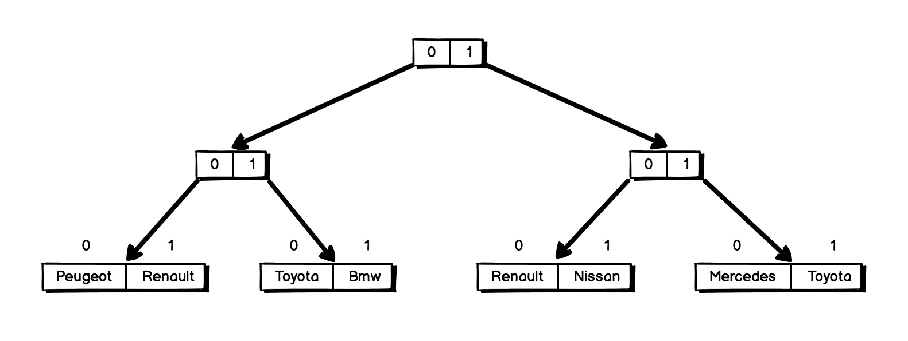
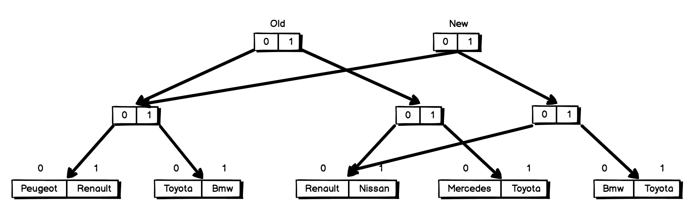

export { default as theme } from './slides-theme';
import { Appear } from 'mdx-deck';
import { CodeSurfer } from 'mdx-deck-code-surfer';
import vsDark from 'prism-react-renderer/themes/vsDark';
import { FullScreenCode } from 'mdx-deck/layouts';

# React tips and tricks

---

## What is this talk about?

<h4>We want to show you a few tips, tricks, patterns, etc. that will help you in your daily work</h4>

---

## Are you ready?

  

---

# Keys

  

---

## Why keys in React are so important?

<ul>
  <Appear>
    <li>Help reconciler algorithm.</li>
    <li>Identify which items have changed, are added, or are removed.</li>
    <li>Should be unique among their siblings.</li>
  </Appear>
</ul>

---

<CodeSurfer
  title="Example 1"
  code={require('!raw-loader!./src/cases/1/example.js')}
  lang="javascript"
  showNumbers
  theme={vsDark}
  steps={[
    {},
    { range: [6, 8], notes: 'state' },
    { range: [16, 34], notes: 'render' },
    { tokens: { 30: [4, 5, 6, 7, 8] }, notes: 'Button handler' },
    { range: [10, 14], notes: 'Add a new list item to the state' },
  ]}
/>

---

# Demo Example 1

---

## How to run it?

<ul>
  <li>
    <code>
      git clone{' '}
      <a href="https://github.com/JonatanGarciaClavo/slab-react-tips-and-tricks.git">
        https://github.com/JonatanGarciaClavo/slab-react-tips-and-tricks.git
      </a>
    </code>
  </li>
  <li>
    <code>cd slab-react-tips-and-tricks</code>
  </li>
  <li>
    <code>npm install</code>
  </li>
  <li>
    <code>npm run start</code>
  </li>
</ul>

---

## Exercise 1

<ol>
  <li>🔎 Check and analyze code.</li>
  <li>👀 Check when click in both buttons how DOM is updated.</li>
  <li>❌ Detect why when click first bottom all our list items get updated.</li>
  <li>✅ Fix problem and check again that DOM updates are right.</li>
  <li>❓ Why it was working for one button and it wasn't for the other?</li>
</ol>

---

# HOCs

  

---

## What the hell are HOCs?

<ul>
  <Appear>
    <li>Is a function that takes a component and returns a new component.</li>
    <li>Principal utility is for reusing component logic.</li>
  </Appear>
</ul>

---

## HOCs tips

<ul>
  <Appear>
    <li>
      <b>Don’t mutate</b> the original component. Use Composition.
    </li>
    <li>
      <b>Pass unrelated props</b> through to the wrapped component.
    </li>
    <li>
      <b>Maximizing composability</b> aka use extra params if you need it.
    </li>
    <li>
      <b>Don’t use</b> HOCs <b>inside the render method.</b>
    </li>
    <li>
      <b>Refs aren’t passed through</b> (use React.forwardRef)
    </li>
  </Appear>
</ul>

---

# Demo Example 2

---

## Exercise 2

What we try to accomplish in this exercise is to build 2 HOC that help us with repetitive behavior of our components.

We need a component that will display a list of characters and a button that will handle when display or not title in our list.

---

# Avoid unnecessary reconciliation

  

---

## Why avoid unnecessary reconciliation is so important?

<ul>
  <Appear>
    <li>Reconciliation is how we call that action that decide when and how to re-render DOM.</li>
    <li>Nobody wants to re-render things all time.</li>
    <li>Seriously, you don't want to re-render your components if their DOM nodes are huge.</li>
    <li>
      Because of that, lets try to help reconciliation algorithm to take easy and fast decisions.
    </li>
  </Appear>
</ul>

---

## So how we could avoid unnecesary reconciliations?

<ul>
  <Appear>
    <li>shouldComponentUpdate()</li>
    <li>PureComponent</li>
    <li>memo</li>
    <li>🚨 Stateless component functions work like React.Components 🚨</li>
  </Appear>
</ul>

---

<CodeSurfer
  title="🚫 Arrow functions"
  code={require('!raw-loader!./slide-examples/avoid-arrow-functions.example')}
  lang="javascript"
  showNumbers
  theme={vsDark}
  steps={[
    { range: [4, 18], notes: 'check props' },
    { range: [23, 33], notes: 'check props and class function' },
  ]}
/>

---

<CodeSurfer
  title="🚫 Objects and Arrays generation in props"
  code={require('!raw-loader!./slide-examples/avoid-object-array.example')}
  lang="javascript"
  showNumbers
  theme={vsDark}
  steps={[
    { range: [1, 10], notes: 'check props' },
    { range: [12, 13], notes: 'create a const outside of component' },
    { range: [18, 21], notes: 'use previously const as props' },
  ]}
/>

---

<CodeSurfer
  title="🚫 Derived data in render"
  code={require('!raw-loader!./slide-examples/derived-data.example')}
  lang="javascript"
  showNumbers
  theme={vsDark}
  steps={[
    { range: [1, 11] },
    { range: [5, 7], notes: '😱 we are filtering our items each render 😱' },
  ]}
/>

---

# Demo Example 3

---

## Exercise 3

This exercise is a bit different compared with the other ones, in this case you need to apply all tips and techniques learned before. That means you need to find and identify issues and try to fix them.

<strong>🚨 Don't get too crazy, all of them should be pretty obvious after what we learned before 😉</strong>

---

# Virtualize your heavy lists

  

---

## Dealing with loooooong lists?

<ul>
  <Appear>
    <li>Pagination</li>
    <li>Infinite Scrolling</li>
  </Appear>
</ul>

---

## But what if that's not an option?

... or small lists but components really big.

<a 
  style={{ marginTop: 40, display: 'block' }}
  href="https://bvaughn.github.io/react-virtualized/#/components/List" 
  target="_blank"
>Virtualize your lists 👉</a>

---

## Windowing

Render only what is visible 💡

  

---

  <CodeSurfer
    title="Example 4"
    code={require('!raw-loader!./src/cases/4/example.js')}
    lang="javascript"
    showNumbers
    theme={vsDark}
    steps={[
      {},
      { range: [7, 9], notes: 'generate list of 5000 personas' },
      { range: [34, 40], notes: 'render' },
      { range: [20, 32], notes: 'Virtualized grid component' },
      { range: [16, 18], notes: 'Cell renderer function' },
    ]}
  />

---

## React window

<Appear>

Is a modern complete rewrite of React Virtualized

👉 <a href="https://react-window.now.sh" target="_blank">react-window</a>

  "I didn't try to solve as many problems or support as many use cases.
  Instead I focused on making the package smaller and faster. 
  I also put a lot of thought into making the API as beginner-friendly as possible."

</Appear>

---

## Exercise 4

  The purpose of this exercise is to implement a virtualized version for the list that we display.
  <ol>
    <li>📥 Import the required elements from the 'react-virtualized' library.</li>
    <li>
      🏗 Recreate the list we actually have with the new virtualized component. Special attention for
      the rowRenderer method.
    </li>
    <li>☝️ Replace the list for the new one in the main component.</li>
    <li>
      🎖 Extra bonus points for using the previously created withToggle HOC to build a toggle system
      to switch between the two lists.
    </li>
  </ol>

---

# Don't mutate...

  
  
...your data structures!

---

## Why inmmutable data structures?

Why should you care if JS doesn’t care?

<ul>
  <Appear>
    <li>Mutable structures are a reason of trust deficit. 🙋‍</li>
    <li>Mutation is a cause of side effects. 🙋‍</li>
    <li>Mutation is a cause of unpredictable state. 🙋‍</li>
    <li>But ... it reuse the memory and is fast. 🤷‍</li>
  </Appear>
</ul>

---

  

---

## Benefits of using immutable.js

<ul>
  <Appear>
    <li>Your data structures change predictably ☝️</li>
    <li>Robust data manipulation ✌️</li>
    <li>Concise readable code 👌</li>
  </Appear>
</ul>

---

## How does it works?

  

  
Structural sharing.

  
Trie, an ordered tree data structure.

---

<Appear>
<code style={{fontSize: 20}}>[“Peugeot”, “Renault”, “Toyota”, “Bmw”, “Renault”, “Nissan”, “Mercedes”, “Toyota”]</code>

  

<code style={{fontSize: 20, marginTop: 40}}>[“Peugeot”, “Renault”, “Toyota”, “Bmw”, “Renault”, “Nissan”, “Bmw”, “Toyota”]</code>

  

</Appear>

---

# Derived Redux state

  

---

## What does 'derived Redux state' means?

Given a state, we need to apply to that state all business logic needed to be displayed in our components.

---

<CodeSurfer
  title="Derived Redux state"
  code={require('!raw-loader!./slide-examples/derived-redux.example')}
  lang="javascript"
  showNumbers
  theme={vsDark}
  steps={[{ range: [1, 8], notes: '🚨 Recalculating derived data can be expensive 🚨' }]}
/>

---

<CodeSurfer
  title="Derived Redux state with reselect"
  code={require('!raw-loader!./slide-examples/reselect.example')}
  lang="javascript"
  showNumbers
  theme={vsDark}
  steps={[
    { range: [1, 1], notes: 'import create selector from reselect' },
    { range: [3, 4], notes: 'domain selector' },
    { range: [6, 11], notes: 'create a selector with your business logic' },
    { range: [12, 14], notes: 'Use a memoized selector' },
  ]}
/>

---

## When we use reselect?

<ul>
  <Appear>
    <li>
      When given a raw data you have to <strong>apply multiple transformations.</strong>
    </li>
    <li>
      When you have to <strong>apply different kind of business logic</strong> to your state.
    </li>
    <li>
      When you <strong>can not normalize</strong> your data.
    </li>
  </Appear>
</ul>

---

# Demo Example 5

---

  <CodeSurfer
    title="Selectors example"
    code={require('!raw-loader!./src/cases/5/example.js')}
    lang="javascript"
    showNumbers
    theme={vsDark}
    steps={[
      { range: [27, 31], notes: 'state' },
      { range: [50, 63], notes: 'domain selectors to get all our state props' },
      { range: [65, 73], notes: 'select and apply filter and short to our list of items' },
      { range: [111, 115], notes: 'Use all our selectors' },
    ]}
  />

---

## Exercise 5

In this exercise we will work with selectors, for that let's build a shopping cart 🙌🏼.

To build this cart we will have a reducer with all our cart items, you don't need to worried about that, is already done 😉.

What you need to complete is how to transform/normalize your cart items to be able to follow some rules/use cases.

---

# React Profiler

  

Monitorize, debug and optimize

---

## React has two working phases

<ul>
  <Appear>
    <li>
      Render: determines what DOM changes need to be made by comparing render results with a
      previous render.
    </li>
    <li>
      Commit: applies any changes that need to happen. Add/remove from the DOM and call lifecycle
      hooks.
    </li>
  </Appear>
</ul>

---

## Demo example Profiler

Let's see it in action 🔍

---

## Exercise 6

✅ The purpose of this exercise is only to use the React Profiler to compare the performance between the previously proposed exercise and the solution.

🕚 Check the benchmark times of rendering to see the differences in performance.

---

# Hooks

  

---

# Hooks

  

---

## Introduction to Hooks

<ul>
  <Appear>
    <li>
      Hooks are functions that let you “hook into” React state and lifecycle features from function
      components
    </li>
    <li>
      This is a feature proposal aka <b>is in alpha.</b>
    </li>
    <li>No Breaking Changes.</li>
    <li>Completely opt-in.</li>
    <li>100% backwards-compatible.</li>
    <li>There are no plans to remove classes from React.</li>
    <li>Hooks don’t replace your knowledge of React concepts.</li>
    <li>🚨 Please, please don't refactor your current code with Hooks 🚨</li>
  </Appear>
</ul>

---

## Motivation

<ul>
  <Appear>
    <li>It’s hard to reuse stateful logic between components.</li>
    <li>Complex components become hard to understand and maintain.</li>
    <li>Classes confuse both people and machines.</li>
    <li>
      <a
        target="blank"
        href="https://babeljs.io/en/repl#?babili=false&browsers=&build=&builtIns=false&spec=false&loose=false&code_lz=JYWwDg9gTgLgBAJQKYEMDG8BmUIjgcilQ3wG4AoUSWOAbzgCEBXGGCAOzgF85tcCiAIxQBnEWXLk0AG1Ei4AYQhN2MJFDhIAHmvYATecnQwAdEvAckquuThw0HETChMM0ABRgcYEQEobdnYiTGDqnt5-FIFwMAAWwCImTihqcAC8AdH2yqoAXHAAckwggmEA7sD6EGUm0hBoKNIAymxQKADmSCadMACSaiDu-A4qMPj-AD4TcAAMvgA0toFcUdxLlWhEIFYwSqPpcO7-aQB8S3ZxCUlIMC0pSO7u9CPWXMcnh7TngS8w-b9wADUcAAjItom9fKsHBZ2DsACLAPQAVTAenu7gA-vM4F4kAA3O5qfxfaIOdhOOjZfY8DKXRLJNSrOzATCHPGEmD3EwAgCEaQyvxJ3zs5JEEGkXTq7SGIhQ-KQ1NU42ZgQqVRqdQazVaHS6Ihu_SQg2GOTGOKFqq4S2tdiI-jCwrJjngzzN3AO9KSXKZ3yIMCYUE4AB5mKwOHAOAppMA0ABrNK0L0bLY7PaqLgnWi_LjBgD0YbY7BOq2tXCAA&debug=false&forceAllTransforms=false&shippedProposals=false&circleciRepo=&evaluate=false&fileSize=false&timeTravel=false&sourceType=module&lineWrap=true&presets=es2015%2Creact%2Cstage-2&prettier=false&targets=&version=6.26.0&envVersion="
      >
        Babel output of class component.
      </a>
    </li>
    <li>
      <a
        target="blank"
        href="https://babeljs.io/en/repl.html#?babili=false&browsers=&build=&builtIns=false&spec=false&loose=false&code_lz=JYWwDg9gTgLgBAJQKYEMDGMA0cDecCuAzkgMowoxLZFICiAZvUhtcQMIoA2nARugNZwAvnHpQIIOAHIoqDFIDcAKFCRYuOACF8MGBAB2w0eMkykfQoUVKl9fPozADcNhHuUoACgCUuJXDg0A0J4AG0g92xiGFd3AF04AF4CYjIKJE8fJIA-OAA5fBAeJC8Ad2B9ABMIUoA6Tgg0LjJoFABzJFqOmABJShBPKQj9GClfAB9xuAAGb29lAKD9ELgKtFkQJBHYkaSUpA5uPjR-TN9E3OidmE9h-ABqOABGOYX9hiYMT38AuCyLvy_X7lKo1eqNZp6KDtTrRPpIAZDNwjKTYO7zH4BISYTFwcLImBxHEBDEBWQwfBQQwAHm0umcBjYnGAJ0SODWGy2MQJQmyODuQmpAHo6Xp9NllEIbNcSrUYMAYJwkHspDKoNYlEgAB5qeCVJD0FD4TjwNXKIA&debug=false&forceAllTransforms=false&shippedProposals=false&circleciRepo=&evaluate=false&fileSize=false&timeTravel=false&sourceType=module&lineWrap=true&presets=es2015%2Creact%2Cstage-2&prettier=false&targets=&version=6.26.0&envVersion="
      >
        Babel ouput of functional component.
      </a>
    </li>
  </Appear>
</ul>

---

## Rules of Hooks

<ul>
  <Appear>
    <li>
      Only call Hooks <b>at the top level</b>. Don’t call Hooks inside loops, conditions, or nested
      functions.
    </li>
    <li>
      Only call Hooks <b>from React function components</b>. Don’t call Hooks from regular
      JavaScript functions.
    </li>
  </Appear>
</ul>

---

## List of Hooks

<ul>
  <Appear>
    <li>useState</li>
    <li>useEffect</li>
    <li>useContext</li>
    <li>useReducer</li>
    <li>useCallback</li>
    <li>useMemo</li>
    <li>useRef</li>
    <li>useImperativeMethods</li>
    <li>useLayoutEffect</li>
  </Appear>
</ul>
<a target="blank" href="https://reactjs.org/docs/hooks-reference.html">Hooks API Reference</a>

---

<CodeSurfer
  title="Counter class"
  code={require("!raw-loader!./slide-examples/counter-class.example")}
  lang="javascript"
  showNumbers
  theme={vsDark}
  steps={[
    { range: [4, 26], notes: 'counter class' },
    { range: [5, 10], notes: 'initialize our state' },
    { range: [15, 21], notes: 'update into local storage our count state' },
    { range: [22, 25], notes: 'render function' },
    { range: [11, 14], notes: 'incrementCount callback' },
  ]}
/>
---

# Demo

### Let's transform previous class into function component with hooks

---

  <CodeSurfer
    title="TODO class"
    code={require('!raw-loader!./src/cases/8/example.js')}
    lang="javascript"
    showNumbers
    theme={vsDark}
    steps={[
      { range: [10, 107], notes: 'todo class' },
      { range: [12, 20], notes: 'constructor' },
      { range: [26, 31], notes: 'componentDidMount' },
      { range: [21, 25], notes: 'update function' },
      { range: [32, 36], notes: 'componentDidUpdate' },
      { range: [80, 106], notes: 'render' },
      { range: [37, 41], notes: 'handleNewChange' },
      { range: [42, 58], notes: 'handleNewSubmit' },
      { range: [59, 65], notes: 'handleDelete' },
      { range: [66, 74], notes: 'handleCompletedToggle' },
      { range: [75, 79], notes: 'handleThemeChange' },
    ]}
  />

---

# Exercise

### Let's transform Todo class into function component with hooks

---

  <CodeSurfer
    title="DevCase class"
    code={require('!raw-loader!./src/cases/9/example.js')}
    lang="javascript"
    showNumbers
    theme={vsDark}
    steps={[
      { range: [15, 59], notes: 'DevCase class' },
      { range: [40, 47], notes: 'mapStateToProps' },
      { range: [49, 54], notes: 'mapDispatchToProps' },
      { range: [16, 18], notes: 'componentDidMount' },
      { range: [20, 38], notes: 'render' },
    ]}
  />

---

# Exercise

### Let's transform DevCase class into function component with hooks

---

# Resources

<ul>
  <li>
    <a href="http://www.benmvp.com/slides/2018/reactalicante/react-perf.html#/">
      Help! My React app is slow!(slides)
    </a>
  </li>
  <li>
    <a href="https://youtu.be/LBzJFcZsPBQ">Help! My React app is slow!(video)</a>
  </li>
  <li>
    <a href="https://reactjs.org/blog/2018/09/10/introducing-the-react-profiler.html">
      Introducing the React Profiler
    </a>
  </li>
  <li>
    <a href="https://building.calibreapp.com/debugging-react-performance-with-react-16-and-chrome-devtools-c90698a522ad?gi=7c59055e576d">
      Profiling React performance with React 16 and Chrome Devtools.
    </a>
  </li>
  <li>
    <a href="https://reactjs.org/docs/optimizing-performance.html">Optimizing Performance</a>
  </li>
  <li>
    <a href="https://evilmartians.com/chronicles/optimizing-react-virtual-dom-explained">
      Optimizing React: Virtual DOM explained
    </a>
  </li>
  <li>
    <a href="https://reactjs.org/docs/hooks-intro.html">Introducing Hooks</a>
  </li>
  <li>
    <a href="https://reactjs.org/docs/hooks-reference.html">Hooks API Reference</a>
  </li>
  <li>
    <a href="https://github.com/kentcdodds/modern-react">Modern React</a>
  </li>
  <li>
    <a href="https://github.com/streamich/react-use">Hooks utils/examples</a>
  </li>
  <li>
    <a href="https://egghead.io/courses/reusable-state-and-effects-with-react-hooks">
      Reusable State and Effects with React Hooks
    </a>
  </li>
  <li>
    <a href="https://nikgraf.github.io/react-hooks/">Collection of React Hooks</a>
  </li>
</ul>

---

# Feeback

  
  

<a href="https://goo.gl/forms/6Hy5GD2oSCSmzNpy2">It is only a minute please!</a>

---

# The end

  

<ul>
  <li>
    <a href="https://github.com/JonatanGarciaClavo/slab-react-tips-and-tricks.git">
      https://github.com/JonatanGarciaClavo/slab-react-tips-and-tricks.git
    </a>
  </li>
  <li>Jonatan García Clavo - jonatan.garcia@sytac.io</li>
  <li>Luis Sanchez Gomez - luis.sanchez@sytac.io</li>
</ul>
